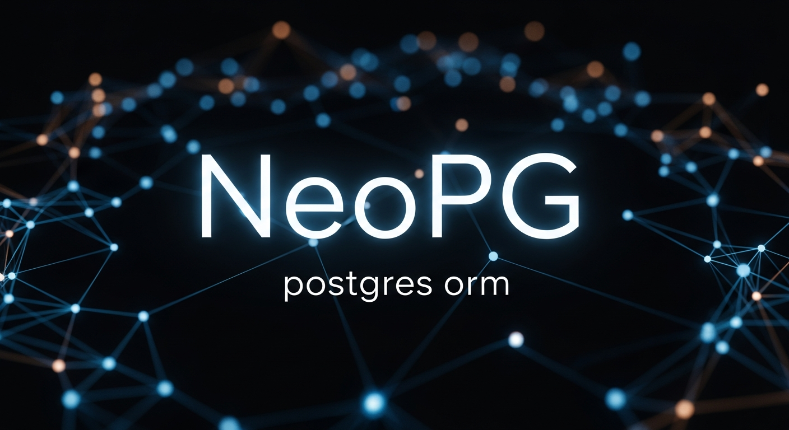

# NeoPG

### Node.js 的下一代 PostgreSQL ORM

**NeoPG** 是一个基于 [postgres.js](https://github.com/porsager/postgres)（Node.js 生态中最快的 PostgreSQL 客户端）构建的高性能、零依赖 ORM。

它完美地融合了链式查询构造器（Query Builder）带来的极佳开发体验（DX）与原生 SQL 模板字符串（Template Literals）的极致性能。

### [📃 English Document 🔗](./README.md)

## 🚀 核心特性

*   **基于 [postgres.js](https://github.com/porsager/postgres)**：继承了 Node.js 最快 PG 客户端的惊人速度和稳定性。
*   **零依赖（Zero Dependencies）**：核心驱动已内置并在内部进行了优化，没有臃肿的依赖树。
*   **混合 API 设计**：既享受流畅的**链式调用**（如 `.where().select()`），又能随时利用**标签模板字符串**处理复杂逻辑。
*   **性能优先**：内部拒绝低效的字符串拼接。所有查询均被编译为高效的片段（Fragment）并原生执行。
*   **自动表结构同步**：在代码中定义模型，NeoPG 会自动同步数据库表结构、索引和外键。
*   **智能类型处理**：自动处理聚合函数的类型转换（例如 `sum`, `avg` 直接返回数字而非字符串），并原生支持 JSON 处理。

---

## 📦 安装

```bash
npm install neopg
```

---

## 🔌 初始化

### 连接数据库

```javascript
const NeoPG = require('neopg');

const config = {
  host: 'localhost',
  port: 5432,
  database: 'my_db',
  user: 'postgres',
  password: 'password',
  max: 10,             // 连接池大小
  idle_timeout: 30,    // 空闲连接超时时间（秒）
  debug: false,        // 是否打印查询日志
  schema: 'public'     // 默认 Schema
};

const db = new NeoPG(config);
```

### 关闭连接

```javascript
await db.close();
```

---

## 📝 定义模型

创建一个模型文件（例如 `models/User.js`）。您的类应当继承自 `NeoPG.ModelChain`。

```javascript
const { ModelChain, dataTypes } = require('neopg')

class User extends ModelChain {
  static schema = {
    tableName: 'users',
    modelName: 'User', // 可选，默认为 tableName
    primaryKey: 'id',
    
    // 基于此定义自动同步表结构
    column: {
      id: { 
        type: dataTypes.ID, // 自动生成类似雪花算法的高性能 ID
      },
      username: { 
        type: dataTypes.STRING(100), 
        required: true 
      },
      email: { 
        type: dataTypes.STRING(255), 
        required: true 
      },
      age: { 
        type: dataTypes.INT, 
        default: 18 
      },
      meta: { 
        type: dataTypes.JSONB 
      },
      created_at: {
        type: dataTypes.BIGINT,
        timestamp: 'insert' // 插入时自动填充时间戳
      },
      updated_at: {
        type: dataTypes.BIGINT,
        timestamp: 'update' // 插入和更新时自动填充
      }
    },

    // 索引定义
    index: ['email', 'age'],
    // 唯一索引定义
    unique: ['username']
  }
}

module.exports = User
```

## 🛠 CLI 模型生成器

NeoPG 内置了一个 CLI 工具，可以快速生成带有样板代码的模型文件。

### 用法

通过 `npx` 直接运行（无需全局安装）：

```bash
npx neopg-model [选项] [模型名称...]
```

### 选项

*   `--dir=<path>`: 指定输出目录（默认：`./model`）。

### 示例

**1. 基础生成**
```bash
npx neopg-model user
# 创建文件: ./model/user.js
# 类名: User
# 表名: user
```

**2. 命名规范（连字符处理）**
输入带连字符的名称，NeoPG 会自动将类名转换为 **大驼峰（CamelCase）**，将表名转换为 **下划线（snake_case）**。

```bash
npx neopg-model user-log
# 创建文件: ./model/user-log.js
# 类名: UserLog
# 表名: user_log
```

**3. 批量生成与自定义目录**
```bash
npx neopg-model --dir=./src/models product order-item
# 创建:
#   ./src/models/product.js
#   ./src/models/order-item.js
```

**4. ES Modules (.mjs)**
如果在名称后加上 `.mjs` 后缀，将生成 ESM 语法（`export default`）的文件。
```bash
npx neopg-model config.mjs
```

---

## ⚙️ 注册与同步

初始化 NeoPG 并注册您的模型。您可以使用类（Class）或配置对象（Object）来定义模型。

### 注册模型

NeoPG 提供了三种注册方法以应对不同场景：

*   **`define(model)`**：标准注册方法。如果同名模型已存在，会抛出错误（`modelName conflict`），防止意外覆盖。
*   **`add(model)`**：同 `define`，行为一致。
*   **`set(model)`**：**强制覆盖/重置**。如果模型已存在，则更新其定义。适用于热重载或动态 Schema 场景。

```javascript
const User = require('./models/User')

// 1. 标准注册 (安全模式)
// 如果 'User' 已经被注册过，此处会报错
db.define(User)

// 2. 强制覆盖 (重置模式)
// 即使 'User' 已存在，也会使用新的定义覆盖它
db.set(User)

// 3. 使用纯对象注册 (快速原型)
db.define({
  tableName: 'logs',
  column: {
    message: 'string',
    level: 'int'
  }
})

console.log(db.has('User'))

```

### 同步数据库

根据已注册的模型同步数据库表结构。

```javascript
// 同步表结构 (DDL)
// options: { force: true } 开启强制模式，会删除 Schema 中未定义的字段，请谨慎使用
await db.sync({ force: false })

console.log('数据库结构已同步！')
```

---

### 📂 自动加载模型

NeoPG 支持扫描指定目录并自动注册所有模型，无需手动逐个引入。

**加载规则：**
*   仅加载 `.js` 和 `.mjs` 后缀的文件。
*   **忽略**以 `_` 开头的文件（可用作目录内的共享工具或基类）。
*   **忽略**以 `!` 开头的文件（可用作临时禁用的模型）。

```javascript
const db = new NeoPG(config)

// 自动加载 ./models 目录下的所有模型
// 注意：这是一个异步方法，因为它兼容 ESM (.mjs) 的动态导入
await db.loadModels('./models')


//加载ESM模块
await db.loadModels('./esmodels', 'esm')

// 加载文件列表
await db.loadFiles(['./models2/WxUser.js', './models2/Role.js'])

// 加载完成后即可同步或使用
await db.sync()
```

---

## 🔍 查询数据

NeoPG 提供了自然流畅的链式 API。

### 基础查询

```javascript
// 获取所有用户
const users = await db.model('User').find();

// 选择特定列
const users = await db.model('User')
  .select('id, username')
  .limit(10)
  .find();

// 获取单条记录
const user = await db.model('User').where({ id: '123' }).get();

// 分页查询
const page2 = await db.model('User').page(2, 20).find(); // 第 2 页，每页 20 条
```

### 链式 Where 条件

```javascript
await db.model('User')
  .where({ 
    age: 18, 
    status: 'active' 
  })
  .where('create_time', '>', 1600000000)
  .where('id IS NOT NULL')
  .find()
```

### 结合模板字符串的复杂查询

这是 NeoPG 的亮点所在。您可以从上下文中解构出 `sql` 标签，安全地混合原生 SQL 片段。

```javascript
// db.sql 是原生的 postgres 实例
const { sql } = db; 

// 通过模板字符串安全地注入参数
await db.model('User')
  .where({ status: 'active' })
  .where(sql`age > ${20} AND email LIKE ${'%@gmail.com'}`)
  .find();
```

---

## 📊 聚合函数

NeoPG 会自动处理类型转换（例如将 PostgreSQL 返回的 `count` 字符串转换为 JavaScript 数字）。

```javascript
// 计数
const total = await db.model('User').where({ age: 18 }).count();

// 最大值 / 最小值
const maxAge = await db.model('User').max('age');

// 求和 / 平均值 (返回 Number 类型，而非 String)
const totalScore = await db.model('User').sum('score');
const avgScore = await db.model('User').avg('score');

// 分组统计
const stats = await db.model('User')
  .select('city, count(*) as num')
  .group('city')
  .find();
```

---

## ✏️ 写入操作

### 插入 (Insert)

```javascript
// 插入单条
const newUser = await db.model('User').insert({
  username: 'neo',
  email: 'neo@matrix.com'
});
// 如果在 Schema 中配置了，ID 和时间戳会自动生成

// 批量插入 (Batch)
await db.model('User').insert([
  { username: 'a' }, 
  { username: 'b' }
]);
```

### 更新 (Update)

```javascript
const updated = await db.model('User')
  .where({ id: '123' })
  .update({
    age: 99,
    meta: { role: 'admin' }
  });
```

### 删除 (Delete)

```javascript
await db.model('User')
  .where('age', '<', 10)
  .delete();
```

### 返回数据 (Returning)

出于性能考虑，写入操作默认可能不返回所有数据。您可以使用 `returning` 强制返回：

```javascript
const deletedUsers = await db.model('User')
  .where('status', 'banned')
  .returning('id, username') // 或者 returning('*')
  .delete();
```

---

## ⚡ 原生 SQL (模板字符串)

NeoPG 暴露了 `postgres.js` 的全部能力。对于极其复杂的查询，您可以跳过 ModelChain 直接使用原生方式。

> 📚 **参考文档**: `sql` 标签的完整用法请参阅 [postgres.js GitHub 主页](https://github.com/porsager/postgres)。

```javascript
// 访问原生驱动
const sql = db.sql;

// 安全执行原生 SQL
const users = await sql`
  SELECT * FROM users 
  WHERE age > ${20}
`;

// 使用 helper 处理动态表名/列名
const table = 'users';
const column = 'age';
const result = await sql`
  SELECT ${sql(column)} 
  FROM ${sql(table)}
`;
```

---

## 🤝 事务处理

NeoPG 提供了一套统一的事务 API，并自动支持嵌套事务（Savepoints）。

### 使用 NeoPG 上下文 (推荐)

```javascript
// 开启一个事务作用域
const result = await db.transaction(async (tx) => {
  // 'tx' 是一个 TransactionScope，拥有和 'db' 几乎一致的 API
  
  // 1. 写入操作 (自动绑定到当前事务)
  const user = await tx.model('User').insert({ username: 'alice' });
  
  // 2. 读取操作
  const count = await tx.model('User').count();
  
  // 3. 抛出错误会自动回滚 (ROLLBACK)
  if (count > 100) {
    throw new Error('Limit reached'); 
  }
  
  return user;
});
// 如果无错误，此处已自动提交 (COMMIT)
```

### 使用原生 Postgres 事务

```javascript
await db.sql.begin(async (sql) => {
  // sql 是当前的事务连接对象
  await sql`INSERT INTO users (name) VALUES ('bob')`;
});
```

---

## License

ISC


